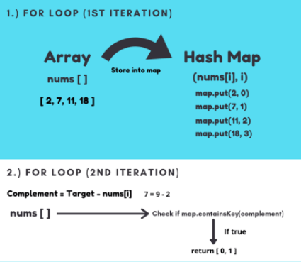

# Leetcode 1. Two Sum
## Hash Table Data Structure and Nested Loops 

### Brute Force - Runtime: 5552 ms, 9.93% of Python3 submissions
```py
# Time Complexity - O(n^2)

class Solution:
    def twoSum(self, nums: List[int], target: int) -> List[int]:
        i = 0
        l = len(nums)
        while(i < l):
            j = i + 1
            while(j < l):
                if nums[i] + nums[j] == target:
                    return [i, j]
                j += 1
            i += 1  
```
### Using Hash Table - 48 ms, 97.50% of Python3 submissions

   

```py
# Time Complexity - O (n) 

class Solution:
    def twoSum(self, nums: List[int], target: int) -> List[int]:
        i = 0
        seen = {}

        while(i < len(nums)):
            if nums[i] in seen.keys():
                return [seen[nums[i]], i]
            seen[target-nums[i]] = i
            i += 1
```

### Cleaned Version of Hash Table Solution
```py
# Time Complexity - O(n)

class Solution:
    def twoSum(self, nums: List[int], target: int) -> List[int]:
        
        seen = {}
        
        for i in range(len(nums)):
            if nums[i] in seen:
                return [seen[nums[i]], i]
            else:
                seen[target - nums[i]] = i 
```