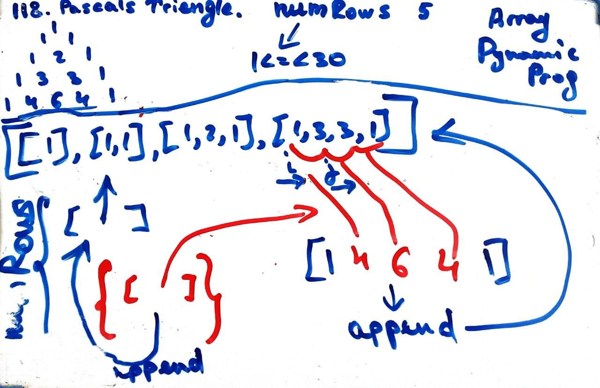

# Leetcode 118. Pascal's Triangle
## Array, Pointers, Dynamic Programming

### Runtime: 32 ms, faster than 65.78% of Python3
### Memory Usage: 14.3 MB, less than 24.38% of Python3
```py
# Time Complexity - O(n^2)

class Solution:
    def generate(self, numRows: int) -> List[List[int]]:
        if numRows == 1:
            return [[1]]
        if numRows == 2:
            return [[1], [1, 1]]

        i = 2
        triangle = [[1], [1, 1]]
        while i < numRows:
            level = [1]
            
            j, k = 0, 1
            while k < len(triangle[-1]):
                level.append(triangle[-1][j] + triangle[-1][k])
                j = j + 1
                k = k + 1
            level.append(1)
            triangle.append(level)
            i = i + 1
                
        return triangle
```

   

