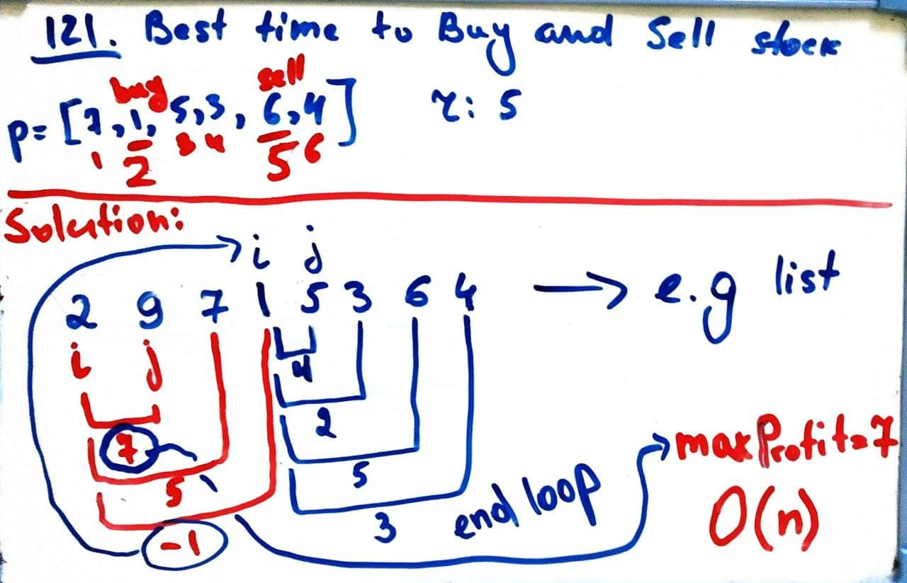

# Leetcode 121. Best Time to Buy and Sell Stock
## Array, Dynamic Programming, Two Pointers

</br>

### Brute Force - Runtime: Time Limit Exceeded
```py
# Time Complexity - O(n^2)
class Solution:
    def maxProfit(self, prices: List[int]) -> int:
        i = j = 0
        l = len(prices)
        maxSum = 0
        while(i < l):
            j = i + 1
            while(j < l):
                maxSum = max(maxSum, prices[j]-prices[i])
                j += 1
            i += 1    
            
        return maxSum
 ```       
 
   


### Brute Force - Runtime: Time Limit Exceeded
```py
# Time Complexity 
 class Solution:
    def maxProfit(self, prices: List[int]) -> int:
        i = 0 
        curSum = 0
        maxSum = 0
        
        while(i<len(prices)-1):
            curSum = max(prices[i+1:]) - prices[i]
            maxSum = max(maxSum, curSum)
            i += 1
            
        return maxSum    
```    

</br>

### Two pointers - Runtime: 1059 ms, faster than 62.12% of Python3

```py
# Time Complexity - O(n)
class Solution:
    def maxProfit(self, prices: List[int]) -> int:
        i = j = 0
        current_profit = 0
        max_profit = 0
        while j < len(prices):
            current_profit = prices[j] - prices[i]
            if current_profit < 0:
                i = j
                j = j + 1
            else:
                j = j + 1
                if current_profit > max_profit:
                    max_profit = current_profit
                    
        return max_profit   
```    

   