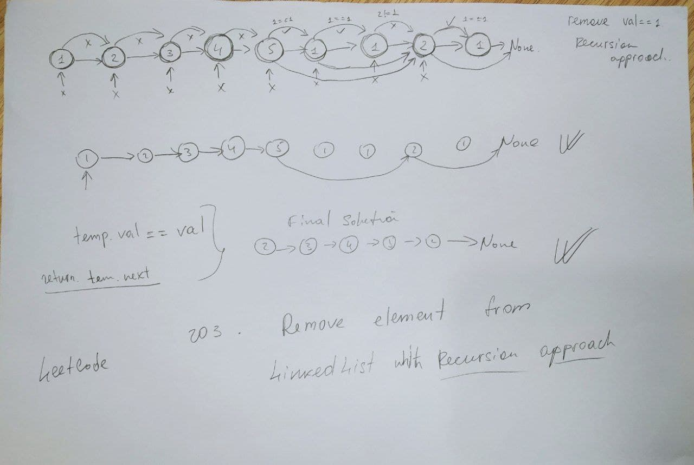

# 203. Remove Linked List Elements

## Recursion approach 

   


```py
# Time Complexity - 

# Definition for singly-linked list.
# class ListNode:
#     def __init__(self, val=0, next=None):
#         self.val = val
#         self.next = next
class Solution:
    def removeElements(self, head: Optional[ListNode], val: int) -> Optional[ListNode]:
        temp = head
        def remove(temp, val):
            if temp == None:
                return head
            if temp.next == None:
                return 0

            remove(temp.next, val)
            
            if temp.next.val == val:
                temp.next = temp.next.next          
        
        remove(temp, val)
        
        if head == None:
            return head
        
        if head.val == val:
            return head.next
        
        return head
        
```