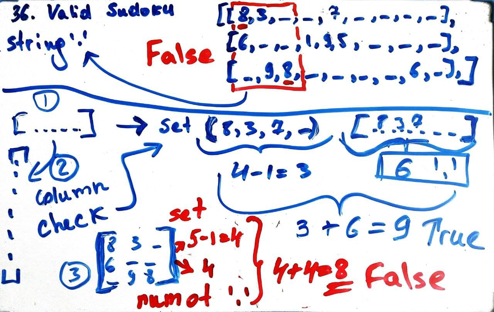

# Leetcode 36. Valid Sudoku
## List comprehensions, Sets, Count

### Runtime: 91 ms, faster than 88.77% of Python3
### Memory Usage: 14.2 MB, less than 71.07% of Python3
```py
class Solution:
    def isValidSudoku(self, board: List[List[str]]) -> bool:
        # 1. Each row must contain the digits 1-9 without repetition.
        for row in board:
            row_set_lenght = len(set(row)) - 1
            number_of_dots = row.count('.')
            if number_of_dots + row_set_lenght != 9:
                return False
            
        # 2. Each column must contain the digits 1-9 without repetition.
        for i in range(9):
            col = [row[i] for row in board]
            col_set_length = len(set(col)) - 1
            number_of_dots = col.count('.')
            if number_of_dots + col_set_length != 9:
                return False
            
        # 3. Each of the nine 3 x 3 sub-boxes of the grid must contain the digits 1-9 without repetition.
        sub_boxes = []
        for r in range(3):
            for c in range(3):
                block = []
                for i in range(3):
                    for j in range(3):
                        block.append(board[3*r + i][3*c + j])
                sub_boxes.append(block)
                
        for sub_box in sub_boxes:
            sub_box_set_lenght = len(set(sub_box)) - 1
            number_of_dots = sub_box.count('.')
            if number_of_dots + sub_box_set_lenght != 9:
                return False
        
        return True
```
  


</br>

## Same solution with functions
```py
class Solution:
    # Check the list is following the rule
    def isFollowingRule(self, line: List[str]) -> bool:
        line_set_length = len(set(line)) - 1
        number_of_dots = line.count('.')
        if number_of_dots + line_set_length != 9:
            return False
        return True
        
    # Get 3 x 3 sub-boxes from board
    def getSubBoxes(self, board: List[List[str]]) -> List:
        sub_boxes = []
        for r in range(3):
            for c in range(3):
                block = []
                for i in range(3):
                    for j in range(3):
                        block.append(board[3*r + i][3*c + j])
                sub_boxes.append(block)
        return sub_boxes
        
        
    def isValidSudoku(self, board: List[List[str]]) -> bool:
        # 1. Each row must contain the digits 1-9 without repetition.
        for row in board:
            if not self.isFollowingRule(row):
                return False
            
        # 2. Each column must contain the digits 1-9 without repetition.
        for i in range(9):
            col = [row[i] for row in board]
            if not self.isFollowingRule(col):
                return False
            
        # 3. Each of the nine 3 x 3 sub-boxes of the grid must contain the digits 1-9 without repetition.
        sub_boxes = self.getSubBoxes(board)    
        for sub_box in sub_boxes:
            if not self.isFollowingRule(sub_box):
                return False
        
        return True         
```