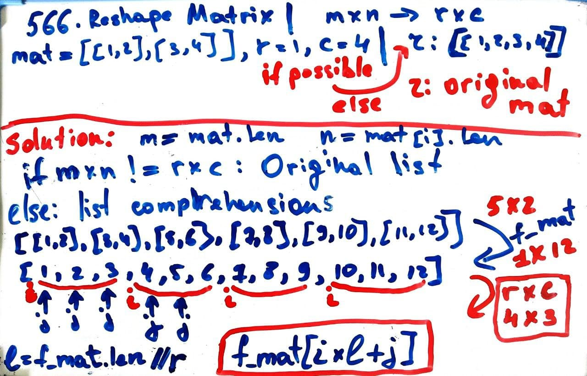

# Leetcode 566. Reshape Matrix
## List comprehensions 

### Runtime: 88 ms, faster than 68.50% of Python3
### Memory Usage: 14.7 MB, less than 96.17% of Python3
```py
# Time Complexity - O(n^2)
class Solution:
    def matrixReshape(self, mat: List[List[int]], r: int, c: int) -> List[List[int]]:
        m = len(mat)
        n = len(mat[0])  
        matrix = []
        
        # Reshape operation with given parameters is not possible
        if m*n != r*c:
            return mat

        flatten_matrix = [val 
                          for sublist in mat
                          for val in sublist]
        
        length = len(flatten_matrix) // r
        for i in range(r):
            # Append an empty sublist inside the list
            matrix.append([])

            for j in range(c):
                matrix[i].append(flatten_matrix[i*length+j])

        return matrix 
```

   
