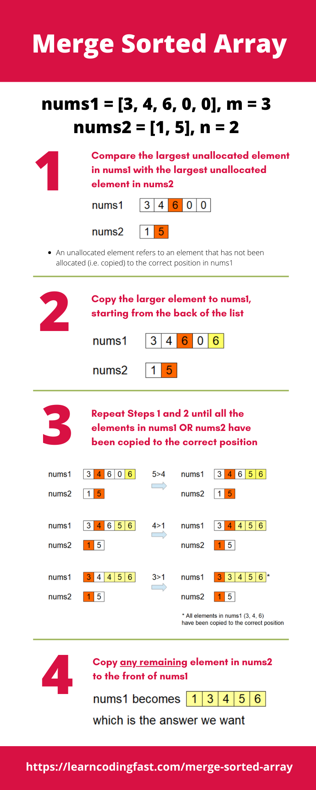

# Leetcode 88. Merge Sorted Array
## Array, Two Pointers, Sorting

### Merge and Sort - Runtime: 32 ms, 92.00% of Python
```py
# Time Complexity - O(n*logn)

class Solution:
    def merge(self, nums1: List[int], m: int, nums2: List[int], n: int) -> None:
        """
        Do not return anything, modify nums1 in-place instead.
        """
        i = m
        j = 0
        while(i<m+n):
            nums1[i] = nums2[j]
            i += 1
            j += 1
        nums1.sort() 
```

### Comparison, Copying - Runtime: 36 ms, 77.33% of Python
```py
# Time Complexity - O(n + m)
class Solution:
    def merge(self, nums1: List[int], m: int, nums2: List[int], n: int) -> None:
        """
        Do not return anything, modify nums1 in-place instead.
        """
        i = m - 1
        j = n - 1
        x = m + n - 1 # Yellow cell in image description below
        
        while(j >= 0 and i >= 0):
            if nums1[i] <= nums2[j]:
                nums1[x] = nums2[j]
                j -= 1
                x -= 1    
            else:
                nums1[x] = nums1[i]
                i -= 1
                x -= 1        
        i = 0        
        while(j>=0):
            nums1[i] = nums2[i]
            j -= 1
            i += 1
```
   
